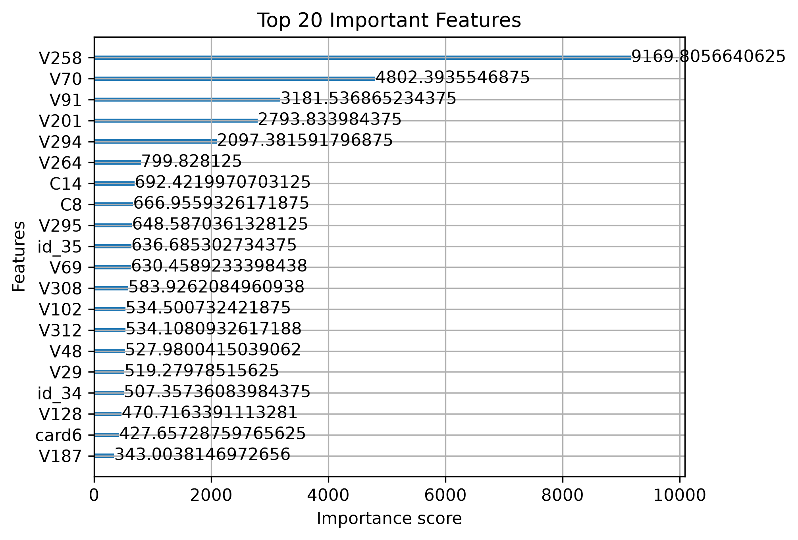
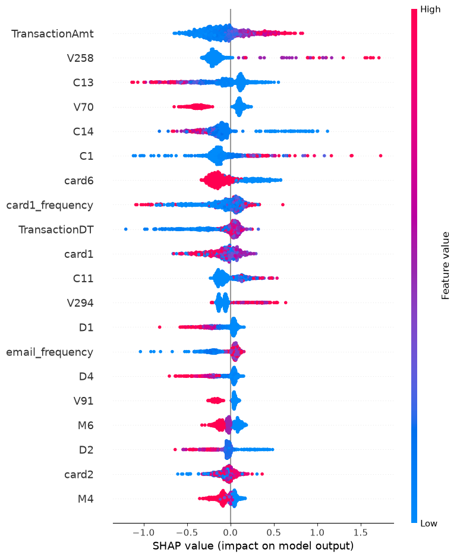

# AI Fraud Detection System

## Project Overview

This project develops an end-to-end fraud detection system using the IEEE-CIS Fraud Detection dataset.

The objective is to identify fraudulent transactions using Machine Learning, Deep Learning, Explainable AI, and Web Deployment techniques.

---

## Dataset

Source: IEEE-CIS Fraud Detection (Kaggle)

- 590,540 transactions
- 430+ features
- Highly imbalanced fraud detection problem

---

## Project Workflow

1. Business Understanding
2. Exploratory Data Analysis
3. Data Cleaning
4. Feature Engineering
5. Machine Learning Models
6. Explainable AI (SHAP)
7. Deep Learning (ANN)
8. Model Selection
9. Streamlit Deployment

---

## Models Evaluated

| Model | ROC-AUC |
|---------|---------|
| Logistic Regression | 0.754 |
| Random Forest | 0.889 |
| XGBoost | 0.952 |
| Weighted XGBoost | 0.957 |
| ANN | 0.914 |

---

## Final Model

Weighted XGBoost

Performance:

- ROC-AUC: 0.957
- Recall: 82.7%
- SHAP Explainability

---

## Deployment Model

A lightweight XGBoost deployment model was created for Streamlit deployment.

Performance:

- ROC-AUC: 0.868

---

## Technologies Used

- Python
- Pandas
- NumPy
- Scikit-Learn
- XGBoost
- TensorFlow
- SHAP
- Streamlit
- GitHub

---

## Business Impact

The system helps financial institutions:

- Detect fraudulent transactions
- Reduce financial losses
- Improve transaction monitoring
- Support fraud investigation

## Feature Importance

## SHAP Explainability

